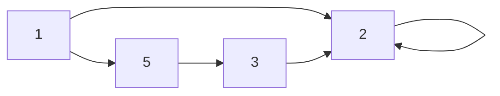

# 개요
이번 Write up에서는 DVWA웹 어플리케이션을 이용해 Command injection공격을 수행하였습니다.

## 목차
[1. **취약점 설명/공부**](#1-취약점-설명)<br/>
[2. **개념증명 실습**](#2-개념-증명)<br/>
[3. **대응 방안**](#3-대응방안)<br/>
[4. 레퍼런스](#레퍼런스)<br/><br/>
## 취약점 정보
<br>

| 정보        | 설명                                             |
| ----------- | ------------------------------------------------ |
| **이름**    | 커맨드 인젝션(command injection)                |
| **심각도**  | 높은                                            |
| **CVSS**    | 10.0                                            |
| **CVSS String** | CVSS:3.1/AV:N/AC:L/PR:N/UI:N/S:C/C:H/I:H/A:H    |
| **위치**    | [http://localhost/vulnerabilities/exec/](http://localhost/vulnerabilities/exec/) |

<br/>
<br/>

# 1. 취약점 설명
## Command injection이란.
웹 애플리케이션을 개발을 할때 기능을 직접 코딩을 해 개발을 하는 것 보다 설치되어 잇는 소프트웨어의 명령어를 통해 기능을 구현하는 것이 더 편리해 그것을 사용할 때가 있다. 이때 파라미터에 사용자가 입력한 인자를 전달할 때 입력값을 제대로 필터링하지 않아 의도한 기능이 아닌 수행을 하는 기능을 실행시키는 Command를 입력하는 것이 Command injection이라고 한다.

다음은 command injection에서 자주사용되는 기본적인 문법인 메타 문자이다.
<br>
<br>

|메타 문자|설명|Example|
|--------|----|-------|
|**\`\`**|**명령어 치환** <code>``</code> 안에 들어있는 명령어를 실행한 결과로 치환됩니다.|  <code>$ echo \`echo theori` theori</code>|
|**$()**|**명령어 치환** `$()`안에 들어있는 명령어를 실행한 결과로 치환 됩니다. 이 문자는 위와 다르게 중복 사용이 가능합니다. (`echo $(echo $(echo theori))`)|<code>$ echo $(echo theori)theori</code>|
|**&&**|**명령어 연속 실행**


#### by. Dreamhack
<br>
<br>
## DVWA취약점.

```php
<?php

if( isset( $_POST[ 'Submit' ]  ) ) {
    // Get input
    $target = $_REQUEST[ 'ip' ];

    // Determine OS and execute the ping command.
    if( stristr( php_uname( 's' ), 'Windows NT' ) ) {
        // Windows
        $cmd = shell_exec( 'ping  ' . $target );
    }
    else {
        // *nix
        $cmd = shell_exec( 'ping  -c 4 ' . $target );
    }

    // Feedback for the end user
    echo "<pre>{$cmd}</pre>";
}

?>
```
이 php코드는 low level의 코드이다. 사용자에게 command를 입력받는 부분을 보면 필터링을 하지 않고있고, 그것을 그대로 불러와 shell_exec를 통해 명령어를 실행시키는 것을 확인할 수 있다. 따라서 BrutForce때와 마찬가지로 low level에서는 해당 취약점에 대한 별다른 시큐어코딩이 되어있지 않다는 것을 알 수 있다. 


# 2. 개념 증명

# 3. 대응방안



# 레퍼런스
- Theori.DreamHack-command injection에 대한 설명: [https://learn.dreamhack.io/187#4](https://learn.dreamhack.io/187#4)


