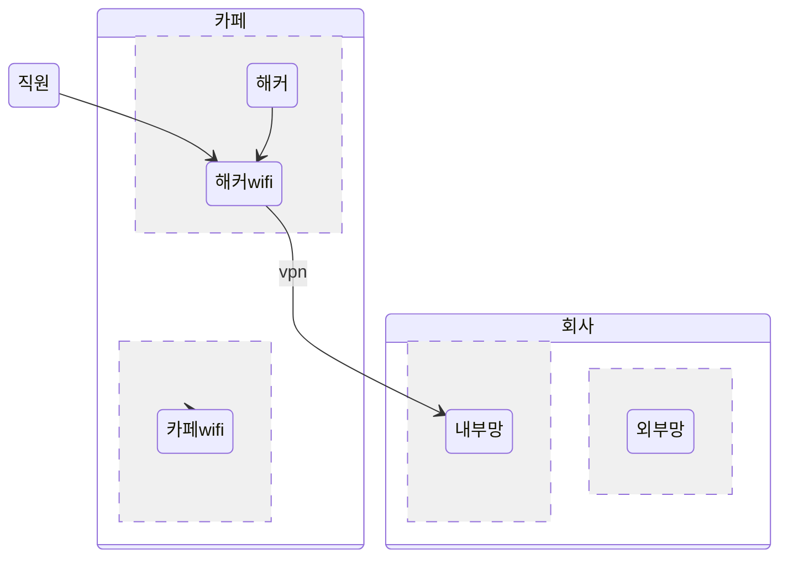

# 개요
이번 글에서는 정보보안 사고 시나리오를 구성하고 해당 원인을 드러낸뒤 책임소재를 밝힐 수 있는 근거가 되는 정보보안 정책 수립후, 사고발생 이후 조치 및 개선사항을 제시하는 과제에 대해 작성을 했습니다.

### 기업에서 발생할 수 있는 보안 사고 시나리오
코로나와 같은 사태이후 많은 회사에서 재택근무를 진행하는 업무가 많이 채택되고 있다. 재택근무 특성상 외부에서 내부망에 접근해 업무를 진행해야 되는데 이떄 외부, 재택근무자들은 회사에서 제공을 하는 VPN을 사용해 접속을 하기로 정책을 수립했다.

하지만 외부에서 근무를 진행하는 직원 한명이 공공장소에서 VPN을 통해 접속을 하는데 이때 사용된 wi-fi가 같은 장소에서 해커가 열어두었던 wi-fi였다. 이로인해 해커는 해당 직원의 네트워크패킷을 감시하며 vpn접속에 대한 정보를 탈취하거나, 해당 직원의 노트북에서 취약점을 찾아 해킹해 해당 VPN접속에 대한 권한을 탈취했다.

이후 해커는 외부에서 그 직원의 VPN을 통해 회사 내부망 접속에 성공하였고 회사의 내부정보들을 유출시켜 회사에 큰 피해를 끼쳤다.

### 해당 사고 발생 시, 책임 소재를 밝힐 수 있는 근거가 되는 정보보안 정책 수립
정책을 수립하기 전 해당 시나리오에서 왜 이러한 사고가난것인지 알아야 한다. 가장먼저 근본적인 원인은 코로나와 같은 팬더믹사태 이후 재택근무가 많이 증가하므로써 회사 외부에서 내부망에대한 접근을 상시 허용해준것이다. 두번째 원인으로는 회사 외부에서 내부망접속을 통해 작업을 하는 직원이 **공공장소**에서 내부망에 접속을 한것이다. 

따라서 첫번째 원인에 대한 정책으로 회사 외부에서 내부망으로 접속에 대한 인원을 제한 하는 것이다. 두번째 원인에 대한 정책으로는 공공장소와 같은 사람이 많은 곳에서는 내부망접속에 대한 접근을 금지하는 것이다.

### 사고 발생 이후, 조치 및 개선사항 제시
우선 사고 발생 전에 다음과 같은 부분을 개선해야한다.
- 첫번째 근본적인 원인으로는 현재 전세계적인 상황으로 봤을 때 불가피하게 어쩔 수 없이 선택된 것일 수 도있다. 하지만 최대한 외부에서 내부망접근에 대한 접근을 최대한 줄여야한다. 

- 두번째 회사 직원의 부주의함으로 인한 원인으로는 외부에서 내부망에 접근을 할 때 공공장소와 같은 많은 사람들이 있는 장소가 아닌 자신의 자택이나, 자신의 사무실에서 접근을 해야한다. 

위와같은 부분을 개선할 경우 해커가 외부에서 내부망으로 접근하는 것에 대한 해킹을 최소화할 수 있다.

만약 이러한 사고가 발생한 이후일 경우 다음과 같은 조치를 취해야한다.
- 해커가 내부로 들어와 만들어둔 백도어를 찾아내 제거
- 해당 VPN에 대한 검증을 재 수립
- 해당 VPN접속 ip와 처음 보는 새로운 ip들의 log들을 분석 후 어떠한 행동을 했는지 분석해 피해의 규모를 확인 후 복구.