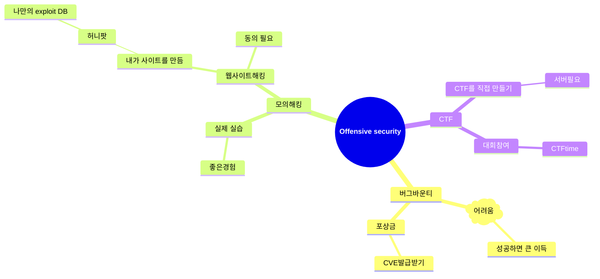
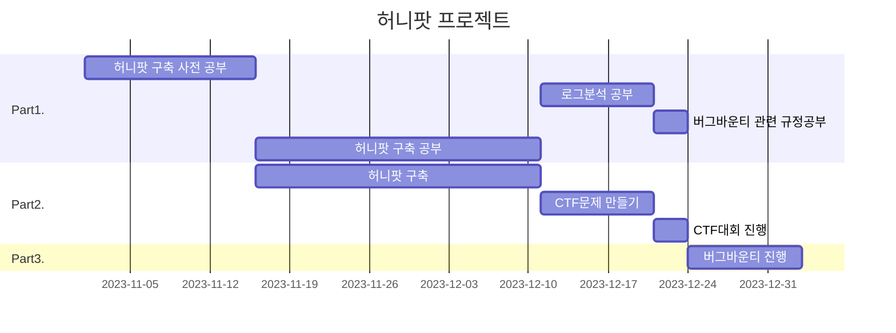

# 개요
이번 가상으로 프로젝트 계획을 세워보는 과제에해 작성했습니다.

## 주제설정
프로젝트를 진행에 대해 가장 먼저해야할 것은 주제를 설정하는 것이다. 주제를 정하기 위해 우선 내가 무엇을 하고싶은지 생각을 해봤다. 내가 하고싶은것은 보안을 공격자의 관점에서 바라보는 Offensive security였다. 따라서 우선 마인드맵을 통해 관련 내용들을 생각해봤다.

정리해본 결과 이러한 내용들이 나왔다. 여기서 나는 한번 만들어놓으면 좋고 나중에 많은 쓸일이 생길 수 있는 허니팟 을 만들기로 주제를 정했다.

## 목표설정
해당 프로젝트를 진행하고 이루어낼 목표를 설정할것이다. 나는 목표를 최대한 높게 잡아 이루지 못하더라도 해당 목표보다 낮은 목표들을 최대한 다 이루는 결과를 생각했다. 따라서 이 프로젝트를 진행하면서의 나의 목표는 다음과 같다.

- 허니팟으로 나만의 exploit DB만들기
- 나만의 expoit DB에서 잘 알려지지 않은 공격기법 얻어내기
- 해당 허니팟 서버로 CTF열기
- 얻어낸 공격기법으로 버그바운티 진행해 공격에 성공해보기
- CVE발급받기

해당 목표들을 달성하기 위해서는 우선 허니팟을 구축하는데에 필요한 지식을 채워야한다. 또한 허니팟은 실제로 블랙햇해커들에게 공격을 받기위함으로 너무 허술하게 만들면 좋은 데이터를 얻지못할것이기에 실제 운영중인 서버와 비슷하게 만들어야한다. 그리고 다 구축이 된 후 WAF에서 잡아내는 로그들을 분석할 줄 알아야한다.

## 일정설정
해당 프젝트를 진행하는 순서는 다음과같다.

여기서 파트를 3부분으로 나누겠다. Part1. 공부파트, Part2. 허니팟, Part3. 버그바운티

이렇게 3개의 파트로 나누어 gantt그래프로 시간을 기준으로 계획을 세워봤다.

## 해당 프로젝트로 인한 효과
위 프로젝트를 진행하면서 얻는 효과는, 허니팟을 구축해 나만의 exploit DB를 만들면 시간이 지날수록 데이터는 쌓일것이고 이것을 통해 버그바운티에 사용할 수 있는 하나의 도구를 얻을 수 있고 이 과정에서 실제 공격에 성공해서 운이좋으면 CVE까지 발급받는 기회가 생길 수 있다. 또 실제 운영서버와 비슷하게 만든 허니팟 서버를 통해 기존 CTF와는 색다른 느낌의 실전경험을 미래 보안인재들에게 제공할 수 있게된다. 물론 여기까지 가는데에 계획했던 시간보다 더 많은시간, 더 많은 노력이 또는 생각치 못한 변수로 인해 실패할 수도 있을 것이다. 하지만 허니팟을 구축하면서 공부했던 서버가 응답과 요청을 보내는 방식, 방화벽을 설정하는법, DB관리 등의 기본 원리를 습득하게 되어 이후 보안을 공부하는데 좋은 토대를 마련할 수 있다. 예를들어 어떻게 WAF나 IPS가 공격을 막아내고 탐지하는지 알게돼 Opffensive security관점에서 어떻게 해야지 이것을 우회해 갈 수 있을지 자연스럽게 생각하고 실제로 우회하고 공격을 하는 것을 시도할 수 있을 것이다.